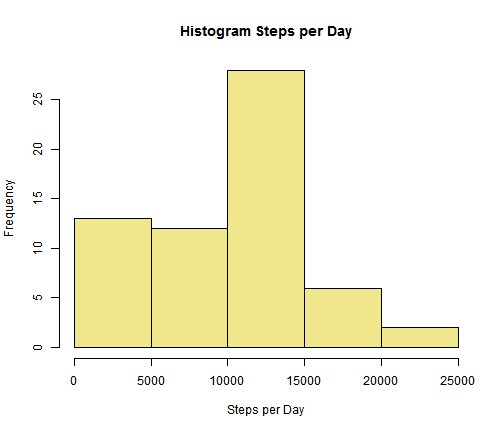
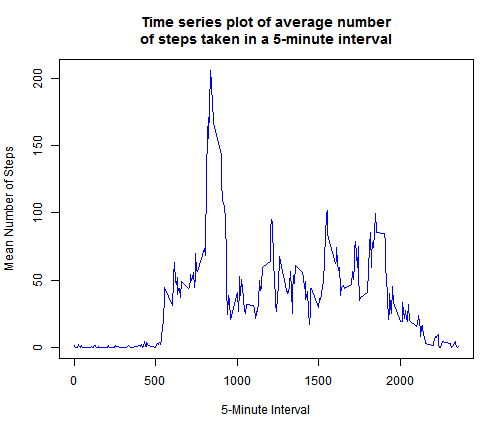
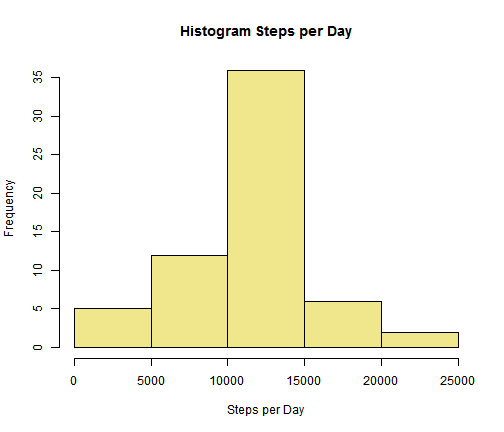
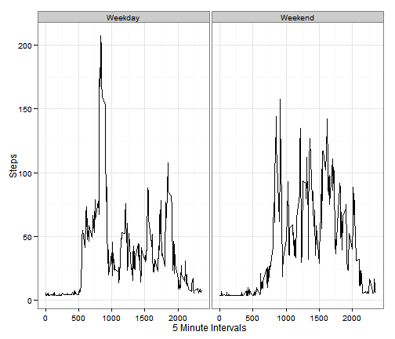

Reproducible Research: Peer Assessment 1
========================================================


## Loading and preprocessing the data

```r
ds <- read.csv(unz("activity.zip","activity.csv"),
               colClasses = c("integer", "character", "integer"),
               comment.char="")
```

---------------

## Total number of steps taken per day
### Histogram of the total number of steps taken each day

```r
steps_per_day <- aggregate(ds$steps, by=list(ds$date),  FUN=sum, na.rm=TRUE)
names(steps_per_day) <- c("date", "steps")
hist(steps_per_day$steps, 
     main="Histogram Steps per Day",
     xlab="Steps per Day",
     col="khaki")
```

 

### Mean and median total number of steps taken per day
Mean steps per day: 9354.2295

Median steps per day: 10395

-----------

## What is the average daily activity pattern?

### Time Series plot 
Time series plot of the 5-minute interval (x-axis) and the average number of steps taken, averaged across all days (y-axis)

```r
avg_steps_per_interval <- aggregate(ds$steps, by=list(ds$interval),  FUN=mean, na.rm=TRUE)
names(avg_steps_per_interval) <- c("interval", "mean_steps")
plot(mean_steps~interval,
     data=avg_steps_per_interval,
     type="l",
     main="Time series plot of average number\nof steps taken in a 5-minute interval",
     xlab="5-Minute Interval",
     ylab="Mean Number of Steps",
     col="blue")
```

 

### Which 5-minute interval, on average across all the days in the dataset, contains the maximum number of steps?
5-minute interval containing the maximum number of steps: 
835

----------

## Imputing missing values
Note that there are a number of days/intervals where there are missing values (coded as NA). The presence of missing days may introduce bias into some calculations or summaries of the data.

### Calculate and report the total number of missing values in the dataset (i.e. the total number of rows with NAs)
Number of rows with missing step data: 2304

### Devise a strategy for filling in all of the missing values in the dataset. 
The missing step data were imputed using a regression model where missing values were replaced with predicted values from the reqression. See [Hill & Gelman (2007, p. 529)](http://www.stat.columbia.edu/~gelman/arm/)

A new dataset was created that was is equal to the original dataset but with the missing data filled in.


```r
ds.lm <- lm(steps ~ interval, data=ds, na.action=na.exclude)
# Create a new data set
ds1 <- ds
ds1$psteps <- predict(ds.lm,ds1)
ds1$steps[is.na(ds$steps)] <- ds1$psteps[is.na(ds1$steps)]
ds1$psteps <- NULL
```
---------

## histogram of the total number of steps taken each day for imputed dataset
Histogram of the total number of steps taken each day.

```r
steps_per_day <- aggregate(ds1$steps, by=list(ds1$date),  FUN=sum, na.rm=TRUE)
names(steps_per_day) <- c("date", "steps")
hist(steps_per_day$steps, 
     main="Histogram Steps per Day",
     xlab="Steps per Day",
     col="khaki")
```

 

Calculate and report the mean and median total number of steps taken per day. 

### Mean and median total number of steps taken per day (imputed dataset)
Mean steps per day: 1.0766 &times; 10<sup>4</sup>

Median steps per day: 1.0766 &times; 10<sup>4</sup>

**Values from the orginal dataset**
### Mean and median total number of steps taken per day (orginal dataset)
Mean steps per day: 9354.2295

Median steps per day: 10395

**These values do differ from the estimates from the first part of the assignment.**

- **Difference in means** (orginal dataset - imputed dataset):
-1411.9592

- **Difference in medians** (orginal dataset - imputed dataset): 
-371.1887

------------
## Are there differences in activity patterns between weekdays and weekends?

1. Create a new factor variable in the dataset with two levels -- "weekday" and "weekend" indicating whether a given date is a weekday or weekend day.

```r
ds1$daytype <- ifelse(weekdays(as.Date(ds1$date)) == "Saturday" | weekdays(as.Date(ds1$date)) == "Sunday", "Weekend", "Weekday")
ds1$daytype <- as.factor(ds1$daytype)
ds$daytype <- ifelse(weekdays(as.Date(ds$date)) == "Saturday" | weekdays(as.Date(ds$date)) == "Sunday", "Weekend", "Weekday")
ds$daytype <- as.factor(ds$daytype)
```

2.Panel plot containing a time series plot of the 5-minute intervals (x-axis) and the average number of steps taken, averaged across all weekday days or weekend days (y-axis).


```r
library(ggplot2)
aggds1 <- aggregate(steps~interval+daytype, data=ds1, FUN="mean")
ggplot(aggds1, aes(interval, steps)) + 
  xlab("5 Minute Intervals") +
  ylab("Steps") +
  geom_line() + 
  theme_bw() +
  facet_grid(~daytype)
```

 
